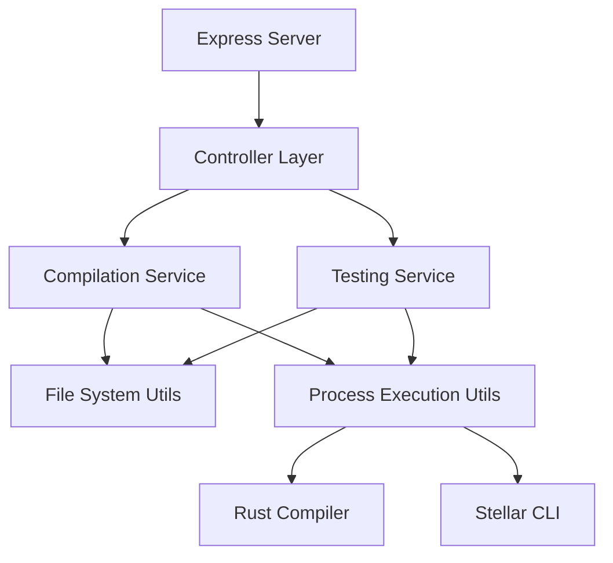

# Stellar IDE Backend

## Overview

The backend component of the Stellar IDE provides a secure and efficient server for compiling and testing Rust smart contracts for the Stellar blockchain. Built with Node.js, Express, and TypeScript, it handles code compilation requests from the frontend, executes Rust and Stellar CLI commands in a controlled environment, and returns the results to the user.

## Table of Contents

1. [Architecture](#architecture)
2. [Core Components](#core-components)
3. [Technologies](#technologies)
4. [Setup and Installation](#setup-and-installation)
5. [API Endpoints](#api-endpoints)
6. [Security Measures](#security-measures)
7. [Development Workflow](#development-workflow)
8. [Testing](#testing)

## Architecture

The backend follows a modular architecture with clear separation of concerns:



## Core Components

| Component | Description | Responsibility |
|-----------|-------------|----------------|
| **Controllers** | API endpoint handlers | Process HTTP requests and responses |
| **Compilation Service** | Code compilation logic | Manages Rust and WASM compilation workflow |
| **Testing Service** | Test execution logic | Manages test execution and result formatting |
| **File System Utils** | File operations | Handles temporary directories and file I/O |
| **Process Execution** | Command execution | Safely executes shell commands with timeouts |

## Technologies

| Technology | Version | Purpose |
|------------|---------|----------|
| Node.js | 20.x | Runtime environment |
| Express.js | Latest | Web framework |
| TypeScript | Latest | Programming language |
| Bun | Latest | Package manager and runtime |
| Rust | Latest | Smart contract compilation |
| Stellar CLI | Latest | Contract optimization |

## Setup and Installation

### Prerequisites

- Node.js (v20.x or later)
- Bun package manager
- Rust toolchain
- Stellar CLI
- WASM target for Rust

### Installation Steps

```bash
# Install Rust (if not already installed)
curl --proto '=https' --tlsv1.2 -sSf https://sh.rustup.rs | sh

# Add WASM target
rustup target add wasm32-unknown-unknown

# Install Stellar CLI
cargo install --locked stellar-cli

# Navigate to the backend directory
cd apps/backend

# Install dependencies
bun install

# Start the server
bun run src/index.ts
```

The server will start on port 3000 by default (configurable via environment variables).

## API Endpoints

| Endpoint | Method | Description | Request Body | Response |
|----------|--------|-------------|--------------|----------|
| `/api/compile` | POST | Compiles Rust code to WASM | `{ code: string }` | `{ success: boolean, output: string, error?: string }` |
| `/api/test` | POST | Runs tests for Rust code | `{ code: string }` | `{ success: boolean, output: string, error?: string }` |
| `/api/health` | GET | Server health check | None | `{ status: "ok" }` |

## Security Measures

### Input Validation

- All incoming requests are validated for proper structure and content
- Empty or non-string code is rejected

### Command Execution

- Uses `child_process.spawn` instead of `exec` to prevent command injection
- All commands run with strict timeouts (30 seconds by default)

### File System Safety

- Uses `sanitize-filename` for directory names
- Creates isolated temporary directories for each compilation/test request
- Automatically cleans up directories after processing

### API Protection

- Implements Helmet for HTTP header security
- Configures CORS to restrict access to trusted origins
- Rate limiting to prevent abuse

## Development Workflow

### Code Organization

```
backend/
├── src/
│   ├── controllers/
│   │   ├── compile.controller.ts
│   │   └── test.controller.ts
│   ├── utils/
│   │   ├── file.utils.ts
│   │   └── process.utils.ts
│   ├── services/
│   │   ├── compilation.service.ts
│   │   └── testing.service.ts
│   ├── middleware/
│   │   ├── validation.middleware.ts
│   │   └── error.middleware.ts
│   └── index.ts
├── tests/
│   ├── unit/
│   └── integration/
├── tsconfig.json
└── package.json
```

## Testing

### Unit Tests

```bash
bun test
```

### Integration Tests

```bash
bun test:integration
```

## Performance Considerations

| Aspect | Implementation | Benefit |
|--------|---------------|--------|
| **Concurrency** | Worker threads for compilation | Handles multiple requests efficiently |
| **Caching** | In-memory cache for repeated compilations | Reduces compilation time for identical code |
| **Timeouts** | Configurable command timeouts | Prevents resource exhaustion |
| **Resource Limits** | Memory and CPU constraints | Ensures system stability |

## Error Handling

The backend implements a comprehensive error handling strategy:

1. **Validation Errors**: Returns 400 Bad Request with details
2. **Compilation Errors**: Returns 200 OK with error details in response
3. **System Errors**: Returns 500 Internal Server Error with safe error message
4. **Timeout Errors**: Returns 408 Request Timeout when commands exceed time limit

## Environment Variables

| Variable | Description | Default |
|----------|-------------|--------|
| `PORT` | Server port | 3000 |
| `CORS_ORIGIN` | Allowed CORS origin | http://localhost:4200 |
| `COMMAND_TIMEOUT` | Command execution timeout (ms) | 30000 |
| `MAX_PAYLOAD_SIZE` | Maximum request body size | 1mb |

## Additional Resources

- [Express.js Documentation](https://expressjs.com/)
- [Rust Documentation](https://www.rust-lang.org/learn)
- [Stellar Soroban Documentation](https://developers.stellar.org/)
