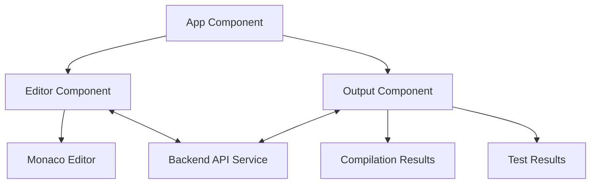

# Stellar IDE Frontend

## Overview

The frontend component of the Stellar IDE provides a modern, responsive web interface for developers to write, compile, and test Rust smart contracts for the Stellar blockchain. Built with Angular and the Monaco Editor, it offers a professional development experience with syntax highlighting, autocompletion, and real-time feedback.

## Table of Contents

1. [Architecture](#architecture)
2. [Key Components](#key-components)
3. [Technologies](#technologies)
4. [Setup and Installation](#setup-and-installation)
5. [Development Workflow](#development-workflow)
6. [Building and Deployment](#building-and-deployment)
7. [Testing](#testing)

## Architecture

The frontend follows a component-based architecture using Angular's best practices:



## Key Components

| Component | Description | Responsibility |
|-----------|-------------|----------------|
| **Editor Component** | Monaco-based code editor | Provides Rust syntax highlighting, autocompletion, and editing capabilities |
| **Output Component** | Results display panel | Shows compilation/test results with proper formatting |
| **API Service** | Backend communication | Handles HTTP requests to the backend for compilation and testing |
| **Theme Service** | UI theming | Manages dark/light theme preferences |

## Technologies

| Technology | Version | Purpose |
|------------|---------|----------|
| Angular | Latest | Frontend framework |
| TypeScript | Latest | Programming language |
| Monaco Editor | Latest | Code editor component |
| Tailwind CSS | Latest | UI styling |
| RxJS | Latest | Reactive programming |
| Bun | Latest | Package manager |

## Setup and Installation

### Prerequisites

- Node.js (LTS version)
- Bun package manager
- Angular CLI

### Installation Steps

```bash
# Navigate to the frontend directory
cd apps/frontend

# Install dependencies
bun install

# Start development server
bun x ng serve
```

Once the server is running, open your browser and navigate to `http://localhost:4200/`. The application will automatically reload whenever you modify any of the source files.

## Development Workflow

### Code Organization

```
frontend/
├── src/
│   ├── app/
│   │   ├── components/
│   │   │   ├── editor/
│   │   │   └── output/
│   │   ├── services/
│   │   │   ├── api.service.ts
│   │   │   └── theme.service.ts
│   │   └── app.component.ts
│   ├── assets/
│   └── environments/
├── angular.json
└── package.json
```

### Code Scaffolding

Angular CLI includes powerful code scaffolding tools. To generate a new component, run:

```bash
bun x ng generate component component-name
```

For a complete list of available schematics (such as `components`, `directives`, or `pipes`), run:

```bash
bun x ng generate --help
```

## Building and Deployment

### Development Build

```bash
bun x ng build
```

### Production Build

```bash
bun x ng build --configuration production
```

This will compile your project and store the build artifacts in the `dist/` directory. The production build optimizes your application for performance and speed.

## Testing

### Unit Testing

To execute unit tests with the [Karma](https://karma-runner.github.io) test runner, use the following command:

```bash
bun x ng test
```

### End-to-End Testing

For end-to-end (e2e) testing, you can use Cypress or Playwright. To set up Cypress:

```bash
bun add -D cypress
bun x cypress open
```

## User Interface

The Stellar IDE frontend provides a clean, intuitive interface with the following key features:

1. **Code Editor**: Monaco-based editor with Rust syntax highlighting and autocompletion
2. **Action Panel**: Buttons for compiling and testing code
3. **Output Panel**: Displays compilation and test results
4. **Theme Toggle**: Switch between light and dark themes

## Security Considerations

- All user code is validated before sending to the backend
- No sensitive data is stored in local storage
- CORS protection is implemented for API requests
- Content Security Policy (CSP) is configured to prevent XSS attacks

## Additional Resources

- [Angular Documentation](https://angular.dev/)
- [Monaco Editor Documentation](https://microsoft.github.io/monaco-editor/)
- [Tailwind CSS Documentation](https://tailwindcss.com/docs)
