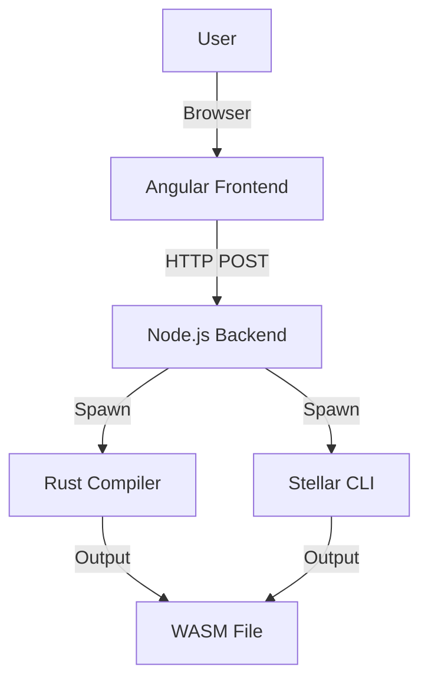

# Product Requirements Document (PRD) - Stellar IDE - Online Soroban Compiler

**Version**: 1.0\
**Date**: Aug 4, 2025\
**Author**: Sebastián Salazar\
**Status**: Approved

## 1. Introduction

### 1.1 Purpose

This PRD outlines the requirements for Stellar IDE, a web-based IDE for developing Rust smart contracts for Stellar’s Soroban platform. The application enables developers to write, compile, and test contracts securely and efficiently, without deployment or interaction capabilities.

### 1.2 Scope

Stellar IDE provides:

- A code editor for Rust with syntax highlighting.
- Compilation to WebAssembly (WASM) using `cargo build` and `stellar contract build`.
- Unit testing with `cargo test`.
- A secure and modular architecture using Angular (frontend) and Node.js (backend).

### 1.3 Definitions

- **Soroban**: Stellar’s smart contract platform.
- **Stellar CLI**: Command-line tool for building Stellar smart contracts.
- **WASM**: WebAssembly, the compilation target for Rust contracts.

## 2. Stakeholders

| Role | Responsibilities |
| --- | --- |
| **Developers** | Primary users; write, compile, and test contracts. |
| **Product Manager** | Defines features and priorities. |
| **Engineering Team** | Implements and maintains the application. |
| **Security Team** | Ensures secure code execution and API protection. |

## 3. Goals and Objectives

### 3.1 Business Goals

- Accelerate Stellar smart contract development.
- Provide a secure and user-friendly IDE.
- Establish a foundation for future Stellar ecosystem tools.

### 3.2 User Goals

- Write Rust code with a modern editor.
- Compile and test contracts without local setup.
- Receive clear feedback on compilation and test results.

## 4. Functional Requirements

### 4.1 User Interface

- **Code Editor**:
  - Monaco Editor with Rust syntax highlighting and autocompletion.
  - Minimum height: 500px.
  - Dark theme by default.
- **Action Buttons**:
  - “Compile” button to trigger `cargo build` and `stellar contract build`.
  - “Test” button to run `cargo test`.
- **Output Panel**:
  - Displays compilation/test results or errors in a scrollable `<pre>` element.
  - Styled with Tailwind CSS for readability.

### 4.2 Compilation

- **Input**: Rust code from the editor.
- **Process**:
  - Create a temporary Rust project with `Cargo.toml` and `src/lib.rs`.
  - Execute `cargo build --target wasm32-unknown-unknown --release`.
  - Run `stellar contract build` to optimize WASM.
- **Output**: Success message or error details.

### 4.3 Testing

- **Input**: Rust code from the editor.
- **Process**:
  - Use the same temporary project as compilation.
  - Execute `cargo test`.
- **Output**: Test results or error details.

### 4.4 Security

- **Input Validation**: Reject empty or non-string code.
- **Command Safety**: Use `child_process.spawn` to prevent injection.
- **Timeouts**: 30-second limit on command execution.
- **Directory Management**: Sanitize directory names; delete after use.
- **API Protection**: Use Helmet and CORS restrictions.

## 5. Non-Functional Requirements

### 5.1 Performance

- Compilation and testing complete within 30 seconds for typical contracts.
- Frontend loads in under 2 seconds.

### 5.2 Scalability

- Backend supports up to 100 concurrent users with Docker isolation (future enhancement).

### 5.3 Security

- No storage of user code on the server beyond temporary directories.
- No exposure of sensitive data (e.g., API keys).

### 5.4 Usability

- Intuitive interface with minimal learning curve.
- Clear error messages for compilation/test failures.

### 5.5 Maintainability

- Modular codebase with TypeScript.
- Automated tests and CI via GitHub Actions.

## 6. Assumptions and Constraints

### 6.1 Assumptions

- Users have basic knowledge of Rust and Stellar smart contracts.
- Backend server has sufficient resources for Rust compilation.

### 6.2 Constraints

- No deployment or contract interaction features.
- Limited to `stellar-cli` for compilation and testing.
- Bun is the only package manager.

## 7. User Stories

| ID | As a... | I want to... | So that... |
| --- | --- | --- | --- |
| US-1 | Developer | Write Rust code in a modern editor | I can create Stellar smart contracts. |
| US-2 | Developer | Compile my code to WASM | I can verify it builds correctly. |
| US-3 | Developer | Run unit tests | I can ensure my contract works as expected. |
| US-4 | Developer | See clear error messages | I can debug issues quickly. |

## 8. Acceptance Criteria

### 8.1 Compilation

- Given valid Rust code, the system compiles it to WASM and displays “Compilation successful” or detailed errors.
- Compilation fails gracefully for invalid code.

### 8.2 Testing

- Given valid Rust code with tests, the system runs `cargo test` and displays results or errors.
- Tests fail gracefully for invalid code.

### 8.3 Security

- No command injection vulnerabilities.
- Temporary directories are deleted after use.
- API endpoints are protected against unauthorized access.

## 9. Technical Requirements

### 9.1 Frontend

- Angular with TypeScript.
- Monaco Editor via `ngx-monaco-editor`.
- Tailwind CSS for styling.
- Bun as package manager.

### 9.2 Backend

- Node.js with Express.js and TypeScript.
- Dependencies: `helmet`, `sanitize-filename`, `cors`.
- Secure command execution with `child_process.spawn`.

### 9.3 Infrastructure

- Rust and `stellar-cli` installed on the backend server.
- Optional: Docker for isolated compilation environments.

## 10. Success Metrics

| Metric | Target |
| --- | --- |
| User Satisfaction | 90% positive feedback from beta testers. |
| Compilation Success Rate | 95% of valid contracts compile without errors. |
| Test Execution Time | &lt; 30 seconds for typical contracts. |
| Security Incidents | Zero vulnerabilities in beta phase. |

## 11. Future Considerations

- Support for multiple files in a contract project.
- User accounts for saving projects.
- Integration with Stellar testnet for deployment (post-MVP).

## 12. Appendix

### 12.1 Architecture Diagram

### 12.2 Glossary

- **Monaco Editor**: Code editor used in VS Code.
- **Bun**: Fast JavaScript runtime and package manager.
- **Stellar CLI**: Tool for building Stellar smart contracts.