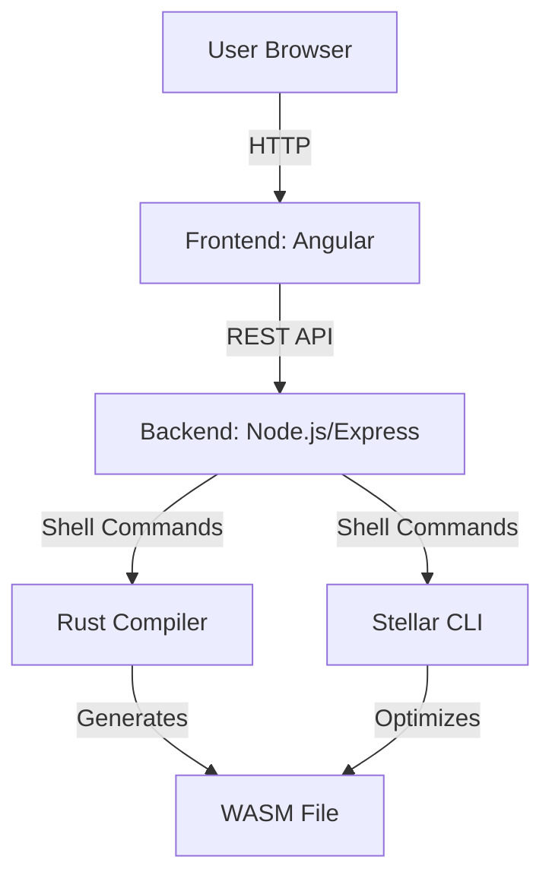

# Online Soroban Compiler - Stellar IDE

A web-based Integrated Development Environment (IDE) for writing, compiling, and testing Rust smart contracts for the Stellar blockchain using the `stellar-cli` tool. The application provides a secure, modular, and high-quality platform for developers to build and test Stellar smart contracts without deployment or interaction capabilities.

## Table of Contents
1. [Overview](#overview)
2. [Features](#features)
3. [Architecture](#architecture)
4. [Project Structure](#project-structure)
5. [Technologies](#technologies)
6. [Setup Instructions](#setup-instructions)
7. [Development Workflow](#development-workflow)
8. [Security Considerations](#security-considerations)
9. [Contributing](#contributing)
10. [License](#license)

## Overview

Stellar IDE is designed to streamline the development of Rust-based smart contracts for Stellar’s Soroban platform. It offers a web interface for editing Rust code, compiling it to WebAssembly (WASM), and running unit tests, all powered by `stellar-cli`. The IDE emphasizes code quality, modularity, and security, making it a robust tool for developers.

### Objectives
- Provide a user-friendly editor for Rust smart contracts.
- Enable secure compilation and testing of contracts.
- Maintain a modular and scalable codebase.
- Ensure high security standards to protect against vulnerabilities.

## Features

| Feature | Description |
|---------|-------------|
| **Code Editing** | Monaco Editor with Rust syntax highlighting and autocompletion. |
| **Compilation** | Compiles Rust code to WASM using `cargo build` and `stellar contract build`. |
| **Testing** | Runs unit tests with `cargo test` and displays results. |
| **Security** | Sanitizes inputs, uses isolated processes, and enforces timeouts. |
| **Modularity** | Separated frontend and backend with reusable components. |

## Architecture

The application follows a client-server architecture:



### Components
- **Frontend**: Angular with Monaco Editor for code editing and result display.
- **Backend**: Node.js with Express.js for handling compilation and testing requests.
- **Rust Compiler**: Executes `cargo build` and `cargo test`.
- **Stellar CLI**: Runs `stellar contract build` for WASM optimization.

## Project Structure

```
Online-Soroban-Compiler/
├── .github/
│   └── workflows/
│       └── angular-ci.yml
│       └── backend-ci.yml
├── apps/
│   ├── frontend/
│   │   ├── src/
│   │   │   ├── app/
│   │   │   │   ├── components/
│   │   │   │   │   ├── editor/
│   │   │   │   │   └── output/
│   │   │   │   └── services/
│   │   │   └── assets/
│   │   ├── angular.json
│   │   └── package.json
│   ├── backend/
│   │   ├── src/
│   │   │   ├── controllers/
│   │   │   ├── utils/
│   │   │   └── index.ts
│   │   ├── tsconfig.json
│   │   └── package.json
├── docs/
│   ├── prd/
│   │   └── PRD.md
├── README.md
└── LICENSE
```

## Technologies

| Component | Technology | Version |
|-----------|------------|---------|
| Frontend | Angular | Latest |
| Frontend | Monaco Editor | Latest |
| Frontend | Tailwind CSS | Latest |
| Frontend | TypeScript | Latest |
| Backend | Node.js | 20.x |
| Backend | Express.js | Latest |
| Backend | TypeScript | Latest |
| Package Manager | Bun | Latest |
| Compiler | Rust | Latest |
| CLI Tool | Stellar CLI | Latest |

## Setup Instructions

### Prerequisites
- Rust: `curl --proto '=https' --tlsv1.2 -sSf https://sh.rustup.rs | sh`
- WASM Target: `rustup target add wasm32-unknown-unknown`
- Stellar CLI: `cargo install --locked stellar-cli`
- Bun: `curl -fsSL https://bun.sh/install | bash`

### Frontend Setup
```bash
cd apps/frontend
bun install
bun x ng serve
```

### Backend Setup
```bash
cd apps/backend
bun install
bun run src/index.ts
```

### Access
Open `http://localhost:4200` in your browser.

## Development Workflow

1. Fork the repository.

2. **Clone the Repository**:
   ```bash
   git clone https://github.com/ScaffoldRust/Online-Soroban-Compiler.git
   ```
> Note: Replace `ScaffoldRust` with your GitHub username.

3. **Install Dependencies**: Use Bun as described above.

4. **Run Tests**:
   - Frontend: `bun x ng test`
   - Backend: `bun test`

5. **GitHub Actions**: A CI workflow ensures code quality (see `.github/workflows/ci.yml`).

6. **Commit Guidelines**: Follow conventional commits (e.g., `feat: add editor component`).

## Security Considerations

- **Input Sanitization**: Uses `sanitize-filename` for directory names.
- **Command Safety**: Employs `child_process.spawn` to prevent command injection.
- **Timeouts**: Limits command execution to 30 seconds.
- **CORS**: Restricted to `http://localhost:4200`.
- **Directory Cleanup**: Removes temporary directories after use.
- **Helmet**: Protects Express.js against common vulnerabilities.

## Contributing

Contributions are welcome! Please follow:
1. Fork the repository.
2. Create a feature branch (`git checkout -b feat/your-feature`).
3. Commit changes using conventional commits.
4. Open a pull request with a detailed description.

<!-- TODO: Add contribution guidelines.

// See [CONTRIBUTING.md](CONTRIBUTING.md) for details.
-->

See the issues on OnlyDust platform: https://www.onlydust.com/repositories/ScaffoldRust/Online-Soroban-Compiler

## License

MIT License. See [LICENSE](LICENSE) for details.
