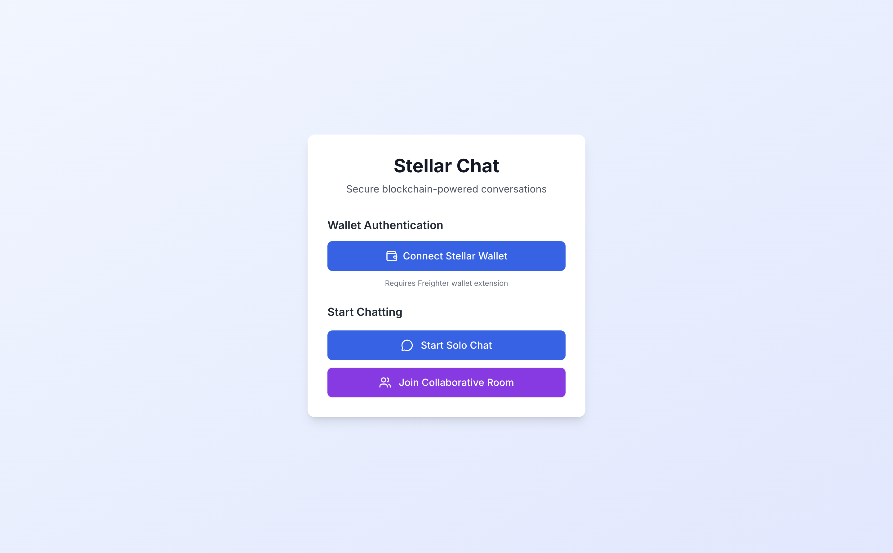
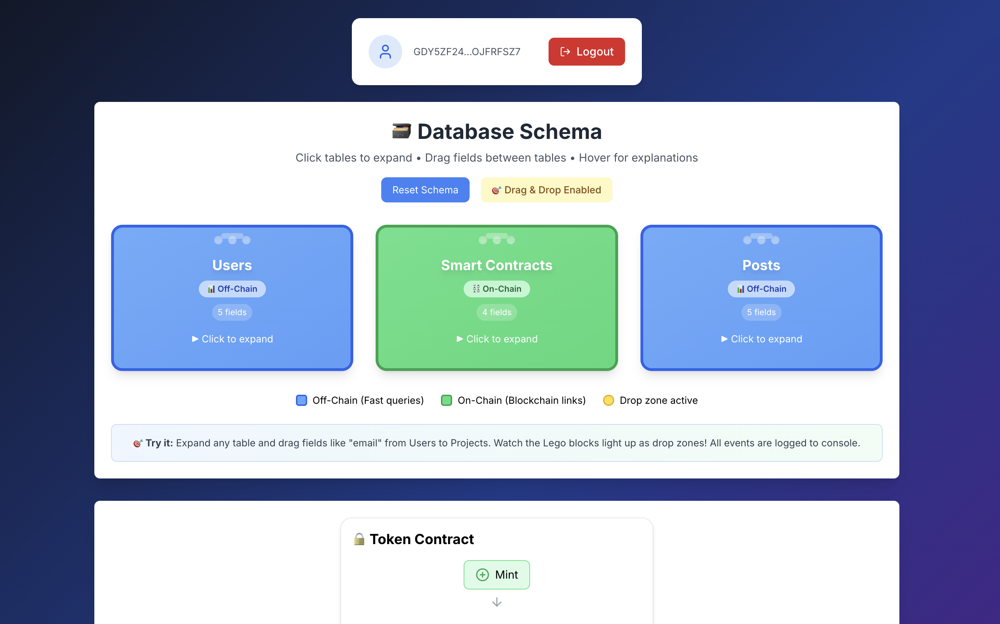

# Chat Flow Guide 

## How to Use Stellar Idea Forge

### Step 1: Connect Your Wallet 
First things first! Click the "Connect Wallet" button and link your Stellar wallet (we support Freighter). This keeps your sessions secure and private.

### Step 2: Choose Your Chat Mode 
- **Solo Chat**: Perfect for personal brainstorming
- **Collaborative Room**: Invite friends to build together!

### Step 3: Describe Your Idea 
Tell us about your project! Be as creative as you want - "A remittance app for families" or "DAO for community decisions".

### Step 4: Get Smart Questions 
Our AI asks helpful questions to understand your idea better and suggest improvements.

### Step 5: See Visual Previews 
Watch your idea transform into diagrams and flowcharts automatically!

### Step 6: Explore Templates 
Get matching project templates (DAO, DeFi, Remesas) and OpenZeppelin contract suggestions.

### Step 7: Collaborate & Share 👥
In collaborative mode, share visuals and templates with your team in real-time.

Happy building! 
